# DockerDeployGHPages

# Config de Husky y Conventional commits

1. Instalar husky
```
yarn add -D husky
```
```
#yarn add-script postinstall "husky install"
yarn dlx husky-init --yarn2 && yarn
```
2. Afegir el conventional commit
```
yarn add -D @commitlint/cli @commitlint/config-conventional
```

Mirar al `package.json` obligatori el postinstall 
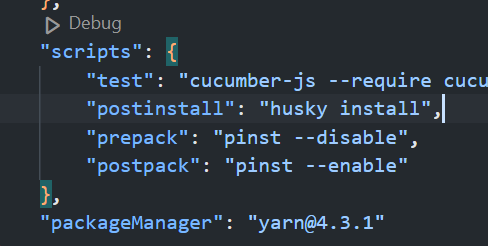

Crear el fitxer `commitlint.config.js` a el nostre directori `root`

dins posarem el següent codi

```JavaScript
module.exports = {
  extends: ["@commitlint/config-conventional"],
};
```
3. Executar husky install

Executarem la comanda 
```
yarn run postinstall
```

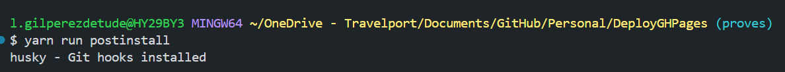

4. Afegirem la comprovació del message a husky

Ho farem per a que s'executi al fer un commit
```
yarn husky add .husky/commit-msg "yarn commitlint --edit $1"
```

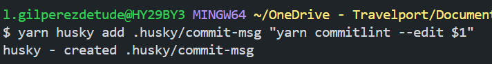

5. Com commitear

Si fem un commit normal, fallarà

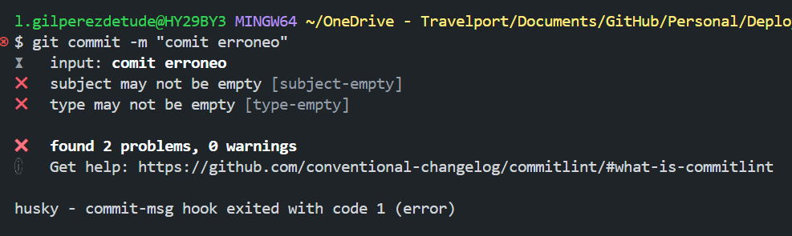

Per a fer un commit normal el que farem serà instalar la extensió de visual studio

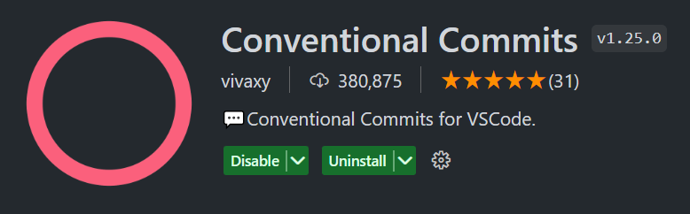

Per a fer un commit ara farem `ctrl + shift + P`

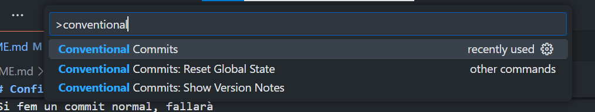
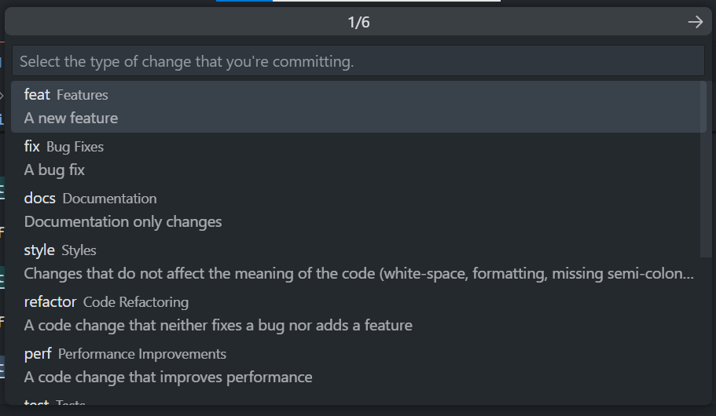
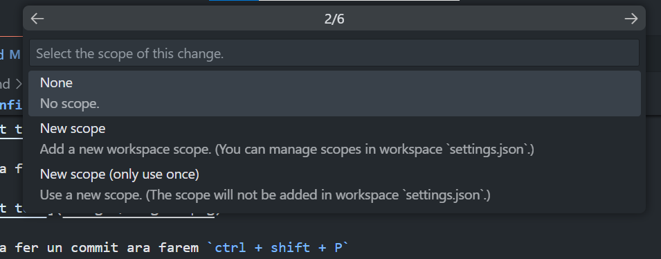

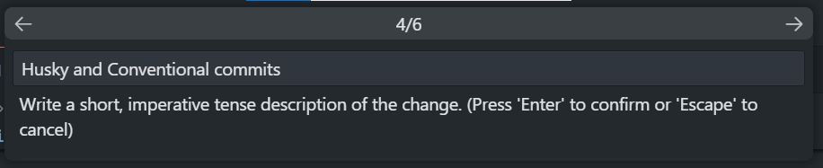
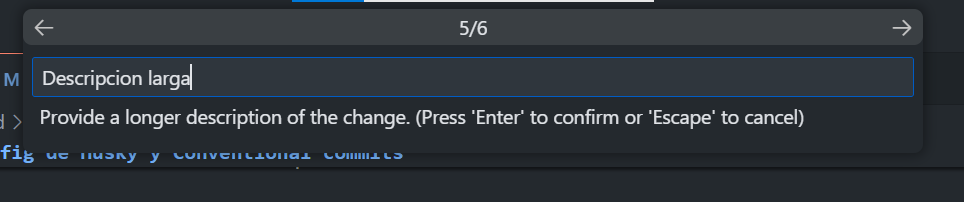
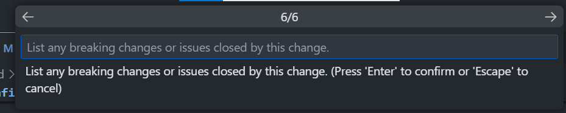

# CREATE A WORKFLOW TO DEPLOY GH PAGES

1. Your package.json file should consist a field `homepage`: 


Afegim la direcció on estarà la nostra GH page

```javascript
  "homepage": "https://<github-username>.github.io/<project-repo>"
```

2.1. Install `gh-pages` via npm:

```javascript
  npm i --save-dev gh-pages
```

2.2. Or yarn:

Afegim gh-actions com a dev dependency

```javascript
  yarn add --dev gh-pages
```

3.1. Add new `script` to `package.json` via `yarn`:

```javascript
    "predeploy": "yarn run build",
    "deploy": "gh-pages -d build"
```

.png)

3.2. Or `npm`:

```javascript
    "predeploy": "npm run build",
    "deploy": "gh-pages -d build"
```


# Code Coverage:

`yarn add -D nyc`

`"coverage": "nyc yarn test"`


